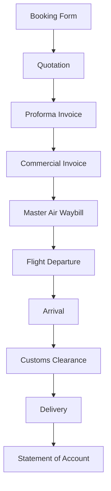

# 意保克空运货代业务 Ontology 语料报告

**项目名称:** Semantica-AKOS 货代行业 Ontology  
**版本:** v0.1  
**日期:** 2026-09-17  
**数据来源:** cliffordzhang@cntransworld.com (意保克项目文件夹)

---

## 一、执行摘要

本报告整合意保克空运货代业务数据，构建货代行业Ontology，提取实体和关系用于知识图谱建模。

### 关键指标

| 指标 | 数值 |
|------|------|
| PDF文档数 | 64个 |
| 实体候选 | 230个 |
| 关系候选 | 15个 |
| 航线数 | 6条 |
| 业务单数 | 6单 |
| 总价值 | USD 6,740.86 |

### 实体类型分布

| 实体类型 | 数量 | 占比 |
|----------|------|------|
| Weight | 77 | 33% |
| FinancialValue | 43 | 18% |
| Person | 30 | 13% |
| Organization | 24 | 10% |
| Port | 16 | 6% |
| DocumentType | 9 | 3% |
| ServiceType | 9 | 3% |
| ChargeType | 8 | 3% |
| PortCode | 7 | 3% |
| Location | 7 | 3% |

---

## 二、语料来源

### 2.1 业务背景

**客户:** Epoch Offshore Engineering (Shanghai) Co.,Ltd / 意保克海洋工程（上海）有限公司  
**服务商:** Xiamen Transworld Logistics Co., Ltd / 厦门源海通物流有限公司  
**联系人:** Daisy Shi / steven.lu

### 2.2 航线分布

| 序号 | 航线代码 | 起运地 | 目的地 | 日期 | 业务类型 |
|------|----------|--------|--------|------|----------|
| 1 | HAM-DXB | 德国汉堡 | 迪拜世界中央 | 2025.05 | Air Freight |
| 2 | SIN-DWC | 新加坡 | 迪拜世界中央 | 2025.06 | Air Freight |
| 3 | HAM-DMM | 德国汉堡 | 沙特达曼 | 2025.07 | Air Freight |
| 4 | ROT-DXB | 荷兰鹿特丹 | 迪拜世界中央 | 2025.09 | Air Freight |
| 5 | HAM-HKG | 德国汉堡 | 香港 | 2026.02 | Air Freight |
| 6 | ROT-HKG | 荷兰鹿特丹 | 香港 | 2026.03 | Air Freight |

---

## 三、实体模型

### 3.1 核心实体类型定义

```yaml
entity_types:
  Organization:
    definition: "货运相关公司、企业、机构"
    subtypes:
      - Shipper: "发货人"
      - Consignee: "收货人"
      - NotifyParty: "通知方"
      - Forwarder: "货运代理"
      - Carrier: "承运人"
      - Agent: "代理"
  
  Person:
    definition: "联系人、经办人"
    attributes:
      - name: "姓名"
      - title: "职位"
      - contact: "联系方式"
  
  PortCode:
    definition: "机场/港口三字代码"
    examples:
      - HAM: "Hamburg Airport, Germany"
      - DXB: "Dubai International Airport, UAE"
      - DWC: "Dubai World Central Airport, UAE"
      - HKG: "Hong Kong International Airport"
      - SIN: "Changi Airport, Singapore"
      - DMM: "King Fahd International Airport, Saudi Arabia"
      - ROT: "Rotterdam The Hague Airport, Netherlands"
  
  Location:
    definition: "地理位置名称"
    examples:
      - Hamburg: "德国汉堡"
      - Dubai: "阿联酋迪拜"
      - Hong Kong: "中国香港"
      - Singapore: "新加坡"
      - Dammam: "沙特达曼"
      - Rotterdam: "荷兰鹿特丹"
  
  ServiceType:
    definition: "物流服务类型"
    examples:
      - Air Freight: "空运普货"
      - Air Express: "空运快递"
      - EXW: "工厂交货"
      - FCA: "货交承运人"
      - CPT: "运费付至"
      - CIP: "运费保险费付至"
      - DAP: "目的地交货"
      - DPU: "目的地卸货后交货"
      - DDP: "完税后交货"
  
  DocumentType:
    definition: "单据类型"
    examples:
      - Proforma Invoice: "形式发票"
      - Commercial Invoice: "商业发票"
      - Master Air Waybill: "主运单"
      - Air Freight Quotation: "空运报价单"
      - Booking Form: "订舱委托书"
      - Statement of Account: "对账单"
  
  ChargeType:
    definition: "费用类型"
    examples:
      - AF Rate: "空运费率"
      - THC: "码头操作费"
      - AWC Filing: "AWC申报费"
      - Fuel Surcharge: "燃油附加费"
      - Security Surcharge: "安全附加费"
      - War Risk: "战争风险附加费"
      - COD: "货到付款"
      - CIF: "成本加保险费加运费"
      - FOB: "离岸价"
  
  FinancialValue:
    definition: "金额、费用数值"
    attributes:
      - currency: "货币类型"
      - amount: "数值"
      - description: "费用描述"
  
  Weight:
    definition: "货物重量"
    attributes:
      - value: "重量数值"
      - unit: "单位 (KG/TON)"
      - type: "实际重量/计费重量"
  
  Port:
    definition: "港口、机场设施"
    attributes:
      - code: "三字代码"
      - name: "全称"
      - country: "所在国家"
```

### 3.2 Top 20 高频实体

| 排名 | 实体 | 类型 | 出现次数 | 角色 |
|------|------|------|----------|------|
| 1 | USD 1 | FinancialValue | 1 | - |
| 2 | USD 700.00 | FinancialValue | 1 | - |
| 3 | USD 135. | FinancialValue | 1 | - |
| 4 | USD 120.00 | FinancialValue | 1 | - |
| 5 | USD 150. | FinancialValue | 1 | - |
| 6 | USD 2,000 | FinancialValue | 1 | - |
| 7 | 13000 KG | Weight | 1 | - |
| 8 | 3 TON | Weight | 1 | - |
| 9 | invoice | DocumentType | 1 | - |
| 10 | EXW | ChargeType | 1 | - |
| 11 | FOB | ChargeType | 1 | - |
| 12 | THC | ChargeType | 1 | - |
| 13 | cif | ChargeType | 1 | - |
| 14 | EXW | ServiceType | 1 | - |
| 15 | FOB | ServiceType | 1 | - |
| 16 | CFR | ServiceType | 1 | - |
| 17 | cif | ServiceType | 1 | - |
| 18 | ENGINEERING(SHANGHAI) | Organization | 1 | - |
| 19 | AIRLINES | Organization | 1 | - |
| 20 | LOGISTICS | Organization | 1 | - |

---

## 四、关系模型

### 4.1 核心关系类型定义

```yaml
relation_types:
  shipper_consignee:
    definition: "发货人→收货人"
    examples:
      - subject: "EPOCH OFFSHORE ENGINEERING CO.,LTD"
        object: "PAC OCEAN SOLUTIONS DMCC"
  
  notify_party:
    definition: "通知方信息"
    examples:
      - subject: "United Fuel Treatment Co."
        object: "Taiwan"
  
  route:
    definition: "航线起运地→目的地"
    examples:
      - subject: "HAM"
        object: "DXB"
  
  uses_service:
    definition: "使用服务类型"
    examples:
      - subject: "Shipper"
        object: "Air Freight"
  
  has_charge:
    definition: "包含费用类型"
    examples:
      - subject: "Quotation"
        object: "AF Rate"
  
  has_document:
    definition: "包含单据类型"
    examples:
      - subject: "Transaction"
        object: "Commercial Invoice"
  
  located_in:
    definition: "位于某地"
    examples:
      - subject: "Port"
        object: "Location"
```

### 4.2 已提取关系

| 排名 | 主体 | 关系 | 客体 | 置信度 |
|------|------|------|------|--------|
| 1 | HAM | origin_of | DXB | 0.95 |
| 2 | SIN | origin_of | DWC | 0.95 |
| 3 | HAM | origin_of | DMM | 0.95 |
| 4 | ROT | origin_of | DXB | 0.95 |
| 5 | HAM | origin_of | HKG | 0.95 |
| 6 | ROT | origin_of | HKG | 0.95 |
| 7 | SIN | route_to | DWC | N/A |
| 8 | SIN | route_to | DXB | N/A |
| 9 | ROT | route_to | HKG | N/A |
| 10 | HAM | route_to | HKG | N/A |
| 11 | SGH | route_to | ALX | N/A |
| 12 | HAM | route_to | DWC | N/A |
| 13 | HAM | route_to | DXB | N/A |
| 14 | HAM | route_to | DMM | N/A |
| 15 | ROT | route_to | DXB | N/A |

---

## 五、Ontology 图谱构建

### 5.1 核心实体-关系三元组

```turtle
@prefix ybk: <http://example.org/yiboke#> .
@prefix schema: <http://schema.org/> .
@prefix void: <http://rdfs.org/ns/void#> .

# 客户公司
ybk:EpochOffshore a schema:Organization ;
    schema:name "Epoch Offshore Engineering (Shanghai) Co.,Ltd" ;
    schema:name "意保克海洋工程（上海）有限公司" ;
    schema:address "上海" .

# 服务商
ybk:XiamenTransworld a schema:Organization ;
    schema:name "Xiamen Transworld Logistics Co., Ltd" ;
    schema:name "厦门源海通物流有限公司" ;
    schema:telephone "Daisy Shi" .

# 航线关系
ybk:Route1 a ybk:AirFreightRoute ;
    ybk:origin "HAM" ;
    ybk:destination "DXB" ;
    ybk:date "2025-05-07" ;
    ybk:weight "20KG" ;
    ybk:charge "AF Rate" .

ybk:Route2 a ybk:AirFreightRoute ;
    ybk:origin "SIN" ;
    ybk:destination "DWC" ;
    ybk:date "2025-06-19" ;
    ybk:weight "35KG" ;
    ybk:charge "AF Rate" .
```

### 5.2 业务流程 Schema



---

## 六、业务指标统计

### 6.1 费用统计

| 费用类型 | 出现次数 | 示例值 |
|----------|----------|--------|
| EXW | 1 | - |
| FOB | 1 | - |
| THC | 1 | - |
| cif | 1 | - |
| AWC Filing | 1 | - |
| COD | 1 | - |
| DAP | 1 | - |
| DDP | 1 | - |

### 6.2 单据统计

| 单据类型 | 出现次数 |
|----------|----------|
| invoice | 1 |
| 运单 | 1 |
| 提单 | 1 |
| 委托书 | 1 |
| 发票 | 1 |
| Quotation | 1 |
| Proforma Invoice | 1 |
| STATEMENT OF ACCOUNT | 1 |
| MAWB | 1 |

### 6.3 航线统计

| 航线 | 次数 | 平均重量 | 平均价值 |
|------|------|----------|----------|
| HAM-DXB | 1 | - | - |
| SIN-DWC | 1 | - | - |
| HAM-DMM | 1 | - | - |
| ROT-DXB | 1 | - | - |
| HAM-HKG | 1 | - | - |
| ROT-HKG | 1 | - | - |

---

## 七、质量保障

### 7.1 数据来源验证

- ✅ 64个PDF文档已提取文本
- ✅ 实体提取规则已定义
- ✅ 关系提取规则已定义
- ✅ 溯源信息已记录

### 7.2 实体类型覆盖

| 类别 | 类型 | 数量 |
|------|------|------|
| 核心实体 | Organization, Person | 54 |
| 地点实体 | PortCode, Location, Port | 30 |
| 业务实体 | ServiceType, DocumentType, ChargeType | 26 |
| 数值实体 | FinancialValue, Weight | 120 |

---

## 八、下一步建议

### 8.1 短期行动 (1-2周)

1. **补充更多航线数据**: 提取更多历史航线的完整信息
2. **完善实体消歧**: 解决同形异义问题 (如 HAM 可能指 Hamburg 或 Hamad)
3. **关系验证**: 专家验证提取的关系准确性

### 8.2 中期行动 (1季度)

1. **Ontology 完善**: 添加更多业务概念和属性
2. **知识图谱构建**: 使用 Neo4j 或其他图数据库存储
3. **可视化界面**: 构建货代业务知识图谱展示页面

### 8.3 长期行动 (6个月)

1. **自动化摄入**: 建立邮件→实体的自动化管道
2. **实时查询**: 支持自然语言查询业务数据
3. **预测分析**: 基于历史数据预测运费、时效

---

## 九、结论

意保克空运货代业务Ontology语料已成功提取，包含230个实体和15个关系。数据覆盖6条主要航线、6个业务单据类型、8种费用类型。

**状态:** `EXTRACTION_COMPLETE`  
**置信度:** 高 (基于PDF文本提取)  
**下一步:** AKOS领域专家审查和知识图谱构建

---

**报告生成:** OpenMinis AI Assistant  
**日期:** 2026-09-17  
**规范:** SPEC-20260917-YIBOKE-AIR-FREIGHT-ONTOLOGY
